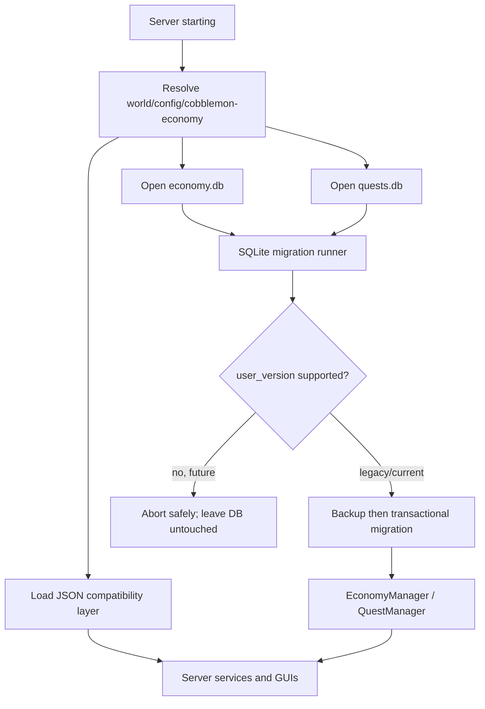

# Persistence and migration guide

Cobblemon Economy stores server data per world in:

```text
world/config/cobblemon-economy/
```

## Files

| File | Format | Compatibility rule |
| --- | --- | --- |
| `config.json` | JSON | Old names and inline `shops` remain readable. |
| `shops.json` | JSON | Preferred non-empty shop source; old bare-map and wrapped formats are accepted, with legacy inline fallback if missing/empty. |
| `milestone.json` | JSON | Missing/invalid files fall back to defaults after quarantine. |
| `quests.json` | JSON | Quest IDs are persistent and must not be renamed silently. |
| `quest_npcs.json` | JSON | NPC IDs and quest pools are persistent references. |
| `quest_boards_bindings.json` | JSON | Position bindings are preserved across reloads. |
| `economy.db` | SQLite | Schema version stored in `PRAGMA user_version`. |
| `quests.db` | SQLite | Independent schema version and migration chain. |

Structured JSON files written by current versions contain `configVersion: 1`;
the legacy flat `milestone.json` map intentionally remains a flat map. The
version field is informational for old files; missing versions are interpreted
as the legacy format. Existing aliases such as `mainCurrency`, `captureReward`,
and `capture_multi_reward` remain accepted.

## SQLite schema versions

### `economy.db` version 1

```text
balances(uuid, balance, pco, username)
purchase_limits(uuid, shop_id, item_id, window_start, count)
sell_limits(uuid, shop_id, item_id, window_start, count)
capture_counts(uuid, count)
capture_milestones(uuid, milestone)
```

### `quests.db` version 1

```text
quest_state(uuid, npc_id, quest_id, status,
            accepted_at, completed_at, claimed_at, available_at)
quest_progress(uuid, npc_id, quest_id, objective_index, progress)
```

Version-zero databases are the historical format. Startup migrates them
additively and preserves all rows. Before an existing database is upgraded,
the mod writes `<database>.bak` in the same directory. If the database reports
a version newer than the bundled mod understands, startup stops with an
explicit error and does not modify that database.

## JSON failure recovery

Before replacing a malformed JSON file, the loader copies it to a timestamped
file such as:

```text
config.json.broken-1760000000000
```

Before any successful replacement of an existing JSON file, the previous file
is copied to `<file>.bak`. Writes use a temporary file and an atomic move when
the filesystem supports it.

## Upgrade and downgrade procedure

1. Stop the server.
2. Back up the complete `world/config/cobblemon-economy/` directory.
3. Install the new mod and start the server once.
4. Check the log for the database migration result.
5. Test `/bal`, `/pco`, `/eco shop list`, and `/eco quest list`.
6. Use `/eco reload` only for JSON changes; restart for database changes.

Do not rename these persisted identifiers without an explicit migration:

- shop IDs;
- shop item IDs used by limits;
- quest IDs;
- quest NPC IDs;
- board binding coordinates.

If a future release must rename one, it must provide an alias migration before
the old ID is removed.

## Architecture



For the release-by-release test results and the complete `0.0.13` → current
migration sequence, see [`version-compatibility.md`](version-compatibility.md).
